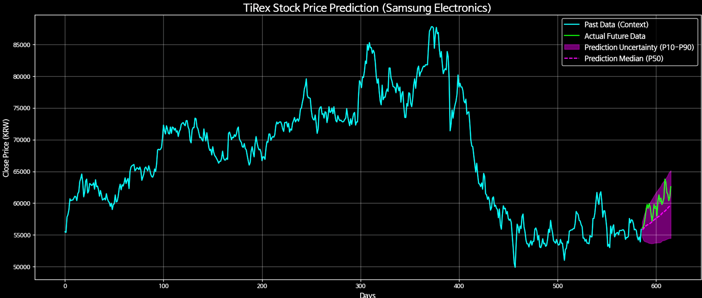
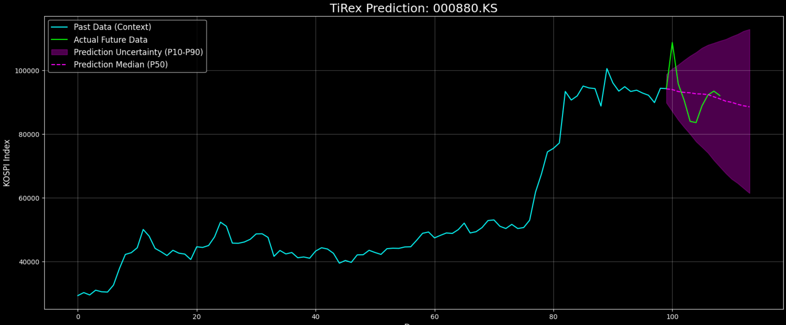
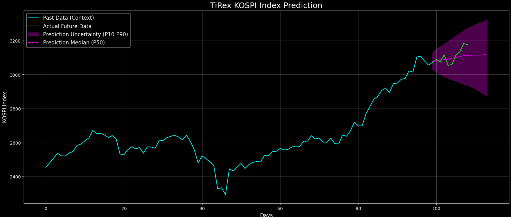
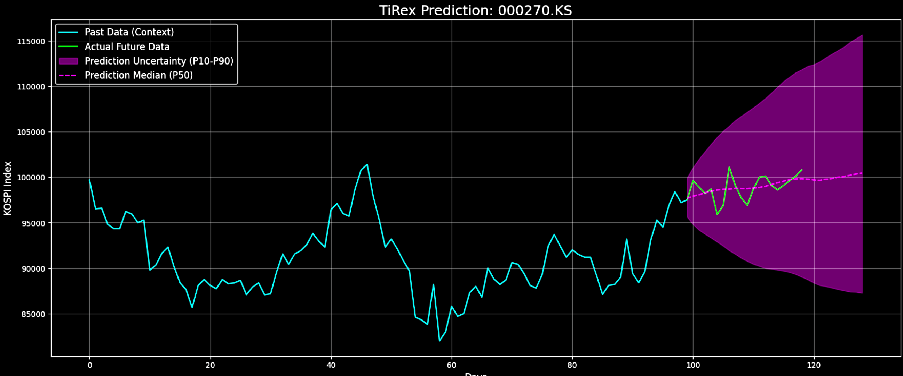
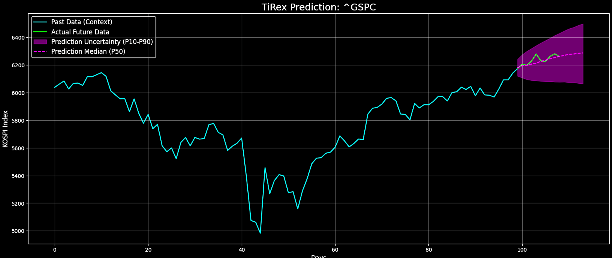
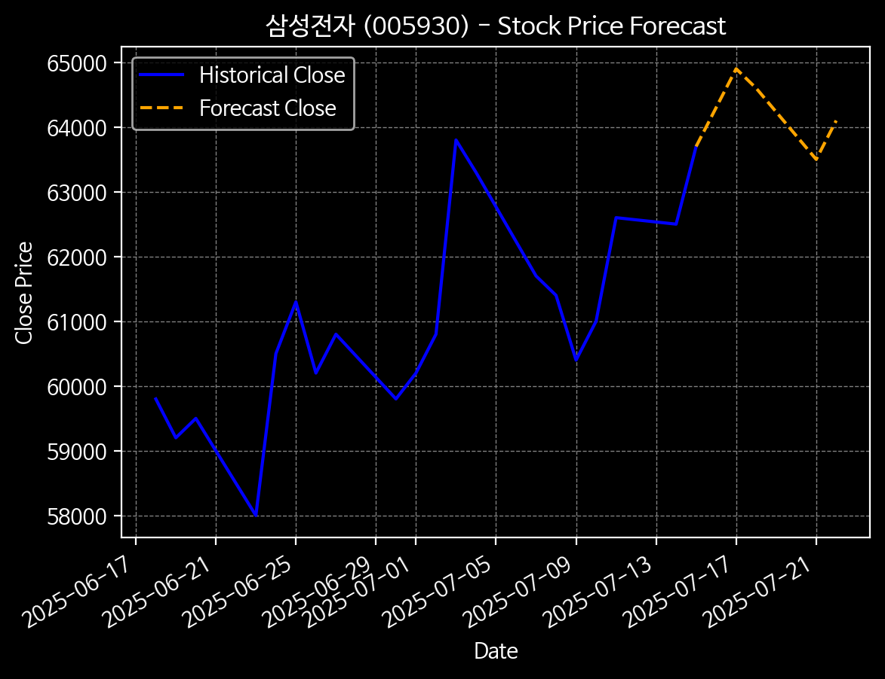

# Financial time series forecasting with AI

First method 

→ Classification model: XGBoost (for Baseline), Transformer
Get stock data with pykrx, news with gnews
Sentiment analysis for the news with ‘tabularisai/multilingual-sentiment-analysis’
And add technical features with ‘ta’
Using class_weights in CrossEntropyLoss to unbalance classes
(decline / flat / rise)

XGBoost: 43.5%, Transformer: 41.7%

⇒ Class Imbalance problem?

Trials (but all failed):

- Data Augmentation (Noise or SMOTE)
- Changing Threshold of Classification
- More technical features or less technical features
- Change model architecture from Transformer to LSTM
- Use FocalLoss Instead of CrossEntropyLoss
- Add EarlyStopping method to prevent Over-Fitting
- Increase dropout value
- Chaning LR
- Gradient Clipping

Okay. I feel like I'm missing something.

Turn a classification problem into a regression problem

→ RMSE: 0.0212

Impressive…. It’s even worse. Okay, regression is much harder than classification.

Roll back into classification

Add macroeconomic scale data using Fred

- KOSPI
- KRW/USD Exchange Rate
- 10-Year Treasury Constant Maturity Rate

⇒ Still low perf…

WHY??????

Okay, let’s use SOTA method in Time-Series Forecasting.

There are ‘Time-R1’, ‘TiRex’.

Start with ‘TiRex’.

[https://github.com/nx-ai/tirex](https://github.com/nx-ai/tirex)

Not working on Windows, non-cuda environment.

Using colab with GPU.

[https://colab.research.google.com/drive/1Db3clnCSY0RTuphZAbTecY2k_WSRHqom?usp=sharing](https://colab.research.google.com/drive/1Db3clnCSY0RTuphZAbTecY2k_WSRHqom?usp=sharing)

It’s better than mine??? It’s just Zero-shot…

Try Time-R1

Nope, I will train Qwen3 4B with GRPO using Unsloth. (Like Fin-R1)

Sooo…. I am gonna make the dataset.

Hmmm?

Should I have to fine-tune?

Why don’t we use just api?

https://tech.kakaobank.com/posts/2403-chatgpt-and-stock-price/

Impressive. Let’s just use LLM with api.
